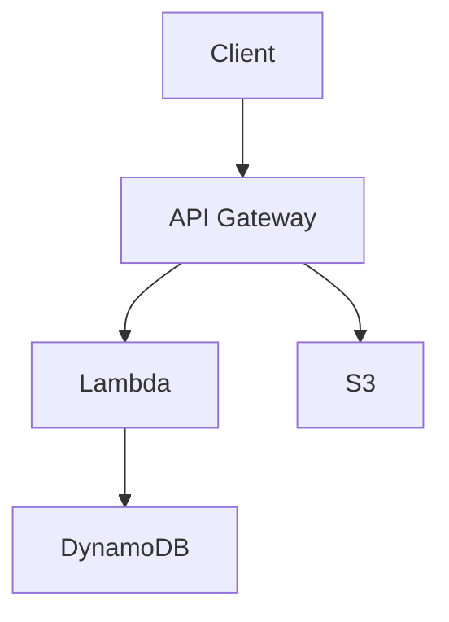

# Markdown Output Test

## テキスト

通常のテキストです。**太字**、_斜体_、~~打ち消し線~~、`インラインコード`。

> ブロッククォート。引用文などに使います。
> 複数行にも対応しています。

---

## リスト

### 箇条書き

- アイテム 1
- アイテム 2
  - ネスト 2-1
  - ネスト 2-2
- アイテム 3

### 番号付き

1. First
2. Second
3. Third

---

## コードブロック

```python
def hello(name: str) -> str:
    return f"Hello, {name}!"

print(hello("Auditive"))
```

```typescript
const greet = (name: string): string => `Hello, ${name}!`;
console.log(greet("Auditive"));
```

---

## テーブル

| Name    | Status    | Note         |
| ------- | --------- | ------------ |
| Track A | PUBLISHED | DNB          |
| Track B | DRAFT     | Experimental |
| Track C | PUBLISHED | Minimal      |

---

## Mermaid



---

## リンク・画像

[GitHub](https://github.com)


